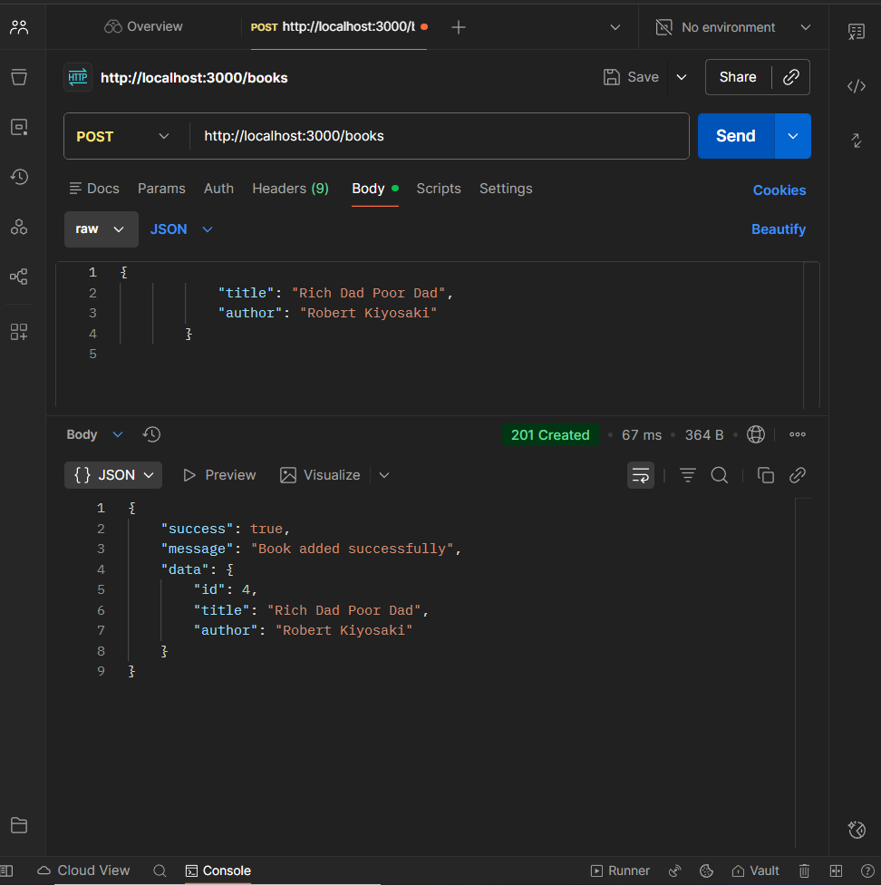

# 📚 Book CRUD REST API (Node.js + Express)

A simple REST API built using **Node.js** and **Express** to manage a list of books.  
This project performs basic **CRUD operations** (Create, Read, Update, Delete) and stores book data in an **in-memory array** (no database used).

---

## 🚀 Features

- Get all books  
- Add a new book
- Update a book by ID
- Delete a book by ID
- JSON request and response structure
- In-memory data store for easy development and demonstration

---

## 🗂️ Project Structure

```
book-crud-api/
│--assets/
|   |-- screenshot-1.png
|   └-- screenshot-2.png
|-- .gitignore
│-- package-lock.json
│-- package.json
└-- server.js
```

---

## ⚙️ Setup & Usage

1. **Install dependencies**
npm install express


2. **Run the server**
node server.js

The server will run at [http://localhost:3000](http://localhost:3000).

3. **API Endpoints**

| Method | Endpoint           | Description             | Request Body          |
|--------|--------------------|-------------------------|-----------------------|
| GET    | `/books`           | Get all books           | -                     |
| POST   | `/books`           | Add a book              | `{ "title": "", "author": "" }` |
| PUT    | `/books/:id`       | Update a book by ID     | `{ "title": "", "author": "" }` |
| DELETE | `/books/:id`       | Delete a book by ID     | -                     |

---

## 🧪 API Testing (Postman Screenshots)

You can test each endpoint using Postman or any similar API client.  
Here are example screenshots:

| Method            | Screenshot                                 |
|-------------------|--------------------------------------------|
| POST `/books`     |   |

---

## 📖 Example API Request & Response

### Update a Book (`PUT /books/:id`)
- **Request Body** (either field optional)
 ```
 {
   "title": "Clean Coder"
 }
 ```

- **Response**
 ```
 {
   "success": true,
   "message": "Book updated successfully",
   "data": {
     "id": 4,
     "title": "Clean Coder",
     "author": "Robert C. Martin"
   }
 }
 ```

---

## 📝 License

MIT License.  
Use, modify, and distribute for educational purposes.

---

## 👩‍💻 Author

**Devi Patil**

---


